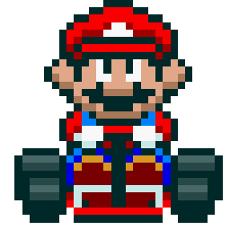
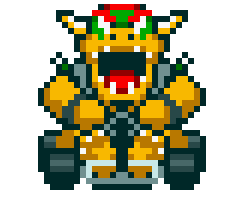

<h1>Desafio de projeto do Felipão: Mario Kart.JS</h1>

<table>
    <tr>
        <td>
            
        </td>
        <td>
            <b>Objetivo:</b>
            
Mario Kart é uma série de jogos de corrida desenvolvida e publicada pela Nintendo. Nosso desafio será criar uma lógica de um jogo de vídeo game para simular corridas de Mario Kart, levando em consideração as regras e mecânicas abaixo.

        </td>
    </tr>
</table>

<h2>Players</h2>
<table style="border-collapse: collapse; width: 800px; margin: 0 auto;">
    <tr>
        <td style="border: 1px solid black; text-align: center;">
            
Mario

            
        </td>
        <td style="border: 1px solid black; text-align: center;">
            
Velocidade: 4

            
Manobrabilidade: 3

            
Poder: 3

        </td>
        <td style="border: 1px solid black; text-align: center;">
            
Peach

            
        </td>
        <td style="border: 1px solid black; text-align: center;">
            
Velocidade: 3

            
Manobrabilidade: 4

            
Poder: 2

        </td>
        <td style="border: 1px solid black; text-align: center;">
            
Yoshi

            
        </td>
        <td style="border: 1px solid black; text-align: center;">
            
Velocidade: 2

            
Manobrabilidade: 4

            
Poder: 3

        </td>
    </tr>
    <tr>
        <td style="border: 1px solid black; text-align: center;">
            
Bowser

            
        </td>
        <td style="border: 1px solid black; text-align: center;">
            
Velocidade: 5

            
Manobrabilidade: 2

            
Poder: 5

        </td>
        <td style="border: 1px solid black; text-align: center;">
            
Luigi

            
        </td>
        <td style="border: 1px solid black; text-align: center;">
            
Velocidade: 3

            
Manobrabilidade: 4

            
Poder: 4

        </td>
        <td style="border: 1px solid black; text-align: center;">
            
Donkey Kong

            
        </td>
        <td style="border: 1px solid black; text-align: center;">
            
Velocidade: 2

            
Manobrabilidade: 2

            
Poder: 5

        </td>
    </tr>
</table>

<h3>🕹️ Regras & mecânicas:</h3>

<ul>
  <li>Dois personagens são escolhidos aleatoriamente para disputar a corrida.</li>
  <li>Os personagens irão correr em uma pista composta por 5 rodadas.</li>
  <li>Em cada rodada, será sorteado aleatoriamente um tipo de bloco da pista: <strong>RETA</strong>, <strong>CURVA</strong> ou <strong>CONFRONTO</strong>.</li>
  <li>
    Dependendo do tipo de bloco:
    <ul>
      <li><strong>RETA</strong>: cada personagem joga um dado de 6 lados e soma o resultado com seu atributo <strong>VELOCIDADE</strong>. Quem tiver o maior valor marca 1 ponto.</li>
      <li><strong>CURVA</strong>: cada personagem joga um dado de 6 lados e soma com seu atributo <strong>MANOBRABILIDADE</strong>. Quem tiver o maior valor marca 1 ponto.</li>
      <li><strong>CONFRONTO</strong>: cada personagem joga um dado de 6 lados e soma com seu atributo <strong>PODER</strong>. Quem tiver o menor valor perde 1 ponto, caso tenha pelo menos 1.</li>
    </ul>
  </li>
  <li>Nenhum personagem pode ficar com pontuação negativa (mínimo é 0).</li>
  <li>Ao final das 5 rodadas, o personagem com mais pontos vence a corrida.</li>
  <li>Em caso de empate, o resultado final será declarado como empate.</li>
</ul>
